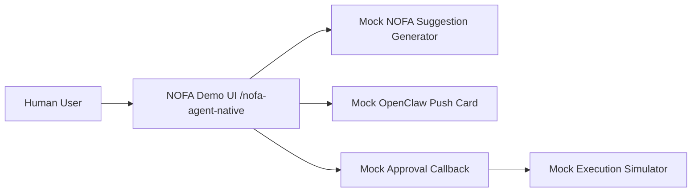
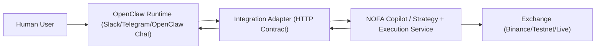
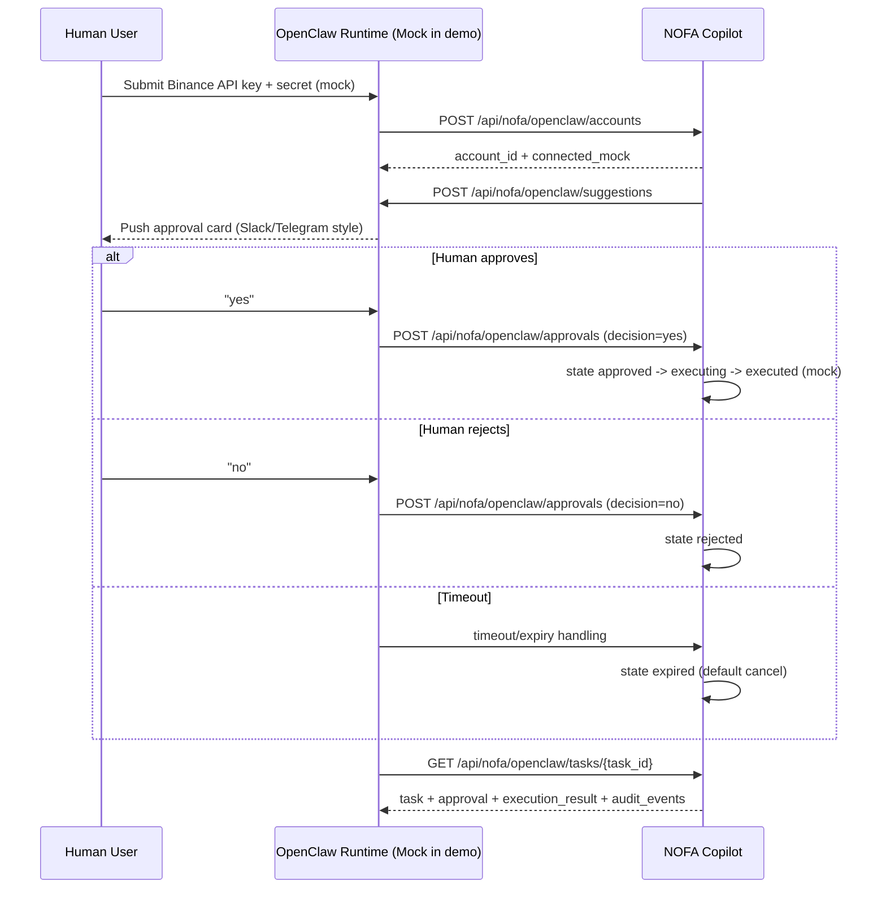
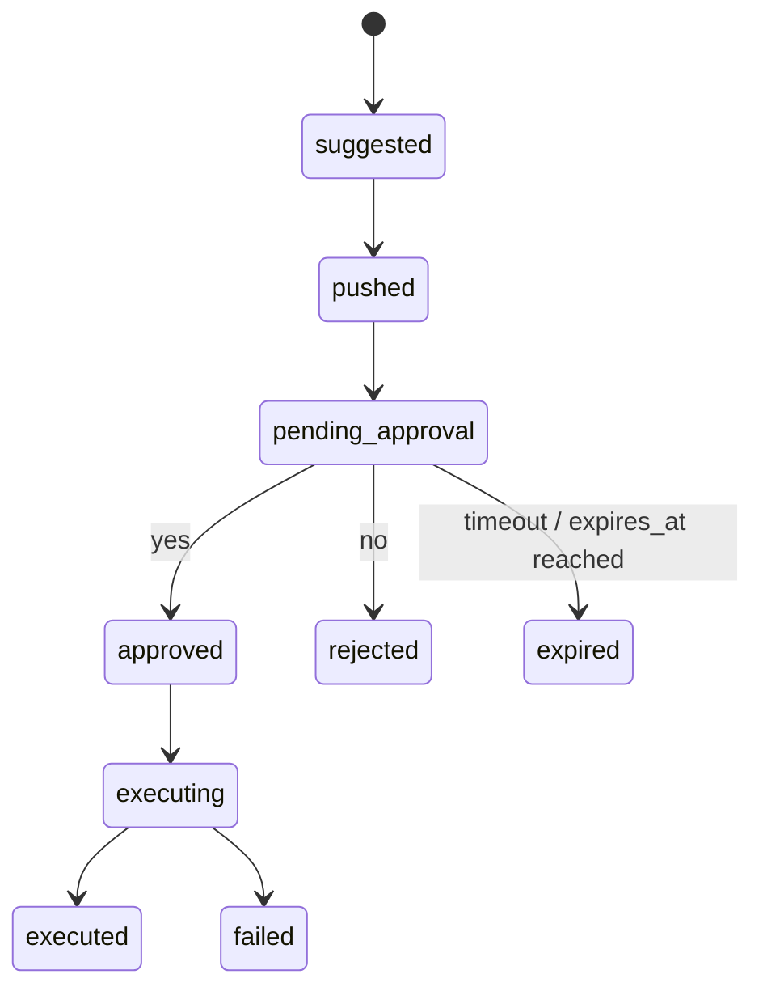

# NOFA x OpenClaw Demo Integration Contract (Mock-Only SSOT, 2026-02-24)

## Scope and Purpose

This document is the single source of truth (SSOT) for the **NOFA x OpenClaw demo integration** on **2026-02-24**.

Demo goal (mock-only):

1. User submits Binance API key in OpenClaw flow (mock)
2. NOFA generates a trade suggestion
3. OpenClaw pushes to human for approval
4. Human replies `yes` / `no`
5. OpenClaw sends decision back to NOFA
6. NOFA executes mock order (only if approved)

Mock-only declaration (required):

- No real Binance validation
- No real exchange order execution
- No real OpenClaw webhook transport in demo page
- No live funds involved

## Architecture (Demo vs Production)

### Demo architecture (implemented in frontend mock)



### Production target architecture (contract only)



Responsibilities:

- `NOFA`
  - Generate `TradeSuggestion`
  - Accept approval callback
  - Enforce timeout/idempotency/risk checks
  - Execute mock/live order depending on environment
- `OpenClaw`
  - Collect user credentials (mock in demo)
  - Present approval request to human
  - Parse human text/button response to canonical `yes` / `no`
  - Callback NOFA with approval payload
- `Integration Adapter` (production)
  - Signature verification and signing
  - Idempotency enforcement
  - Audit persistence
  - Retry/timeout handling

## Canonical Data Model and State Names (Must Match Frontend Demo)

These names must remain consistent across docs, frontend demo, and backend adapter.

### UI flow state strip (`currentMachineState`)

- `idle`
- `api_key_submitted`
- `pending_approval`
- `approved`
- `rejected`
- `executed_mock`

### Canonical task state (`TradeDecisionTask.state`)

- `suggested`
- `pushed`
- `pending_approval`
- `approved`
- `rejected`
- `executing`
- `executed`
- `failed`
- `expired`

## End-to-End Sequence (Co-Pilot Demo)



## State Machine (Authoritative)



Transition rules:

- `pending_approval -> expired` is the default timeout behavior (`Timeout default cancel`)
- `rejected` is terminal for demo
- `executed`, `failed`, `expired` are terminal for demo
- duplicate approval callbacks after terminal state must be handled idempotently (no duplicate execution)

## Skill Contract (OpenClaw Skill)

Skill name (authoritative):

- `nofa-trading-copilot-approval`

### Skill Input Payload (NOFA/Adapter -> OpenClaw)

```json
{
  "task_id": "task_abc123",
  "suggestion_id": "sug_123",
  "user_id": "u_001",
  "account_id": "acc_binance_demo_001",
  "mode": "copilot",
  "exchange": "binance",
  "symbol": "BTCUSDT",
  "action": "OPEN_NEW_ORDER",
  "side": "BUY",
  "quantity": 0.1,
  "leverage": 8,
  "tp": 65000,
  "sl": 62500,
  "rationale": "MACD reversal with bullish funding rate",
  "expires_at": "2026-02-24T15:10:00Z",
  "risk": {
    "confidence": 0.72,
    "risk_level": "medium"
  },
  "approval_actions": ["yes", "no"],
  "deep_link": "https://app.nofa.ai/copilot?suggestion_id=sug_123"
}
```

### Skill Output Payload (OpenClaw -> NOFA callback)

```json
{
  "task_id": "task_abc123",
  "suggestion_id": "sug_123",
  "decision": "yes",
  "approved_by": "u_001",
  "channel": "slack",
  "decided_at": "2026-02-24T15:06:12Z",
  "message_id": "slack_msg_001",
  "raw_response_text": "YES"
}
```

Allowed values aligned with frontend demo types:

- `mode`: `pilot` | `copilot`
- `exchange`: `binance` | `aster` | `hyperliquid`
- `action`: `OPEN_NEW_ORDER` | `CLOSE_ORDER` | `ADJUST_SLTP`
- `side`: `BUY` | `SELL`
- `channel`: `slack` | `telegram` | `openclaw_chat`
- `decision`: `yes` | `no`

## yes/no Parsing Rule (Case-insensitive, Required)

Normalization pipeline:

1. Trim leading/trailing whitespace
2. Convert to lowercase
3. Match exact token against allow-list

Accepted as `yes`:

- `yes`
- `y`
- `approve`
- `approved`

Accepted as `no`:

- `no`
- `n`
- `cancel`
- `reject`

Behavior:

- Case-insensitive (for example `YES`, `Yes`, `yEs` => `yes`)
- Unknown text => `needs_confirmation` (do not execute, do not auto-map)
- Empty text => `needs_confirmation`
- Button clicks should send canonical values directly (`yes` / `no`)

## Security, Reliability, and Risk Controls (Contract)

### Signatures (required in production contract)

- `X-NOFA-Signature`: request signed by NOFA when sending to OpenClaw/adapter
- `X-OpenClaw-Signature`: callback signed by OpenClaw when sending to NOFA

Recommended signature method (production):

- HMAC-SHA256 over raw request body
- shared secret per integration tenant/environment
- include timestamp in signed payload or companion header to prevent replay

Demo note:

- Demo UI may display these headers, but does not verify signatures

### Idempotency (required)

- Primary idempotency key: `suggestion_id`
- Approval callback processing must guarantee: **at most one effective decision execution per `suggestion_id`**
- Duplicate callbacks with same final decision should return success-compatible idempotent response
- Conflicting duplicate callback after terminal state should not trigger re-execution

### Timeout and expiry (required)

- `Timeout default cancel`
- Source of truth for expiry: `suggestion.expires_at`
- When timeout occurs before valid approval, task moves to `expired`
- Approval callback received after `expired` should be rejected with an expiry error (no execution)

### Additional controls

- Mask credentials in logs/UI (`masked_key` only)
- Validate `user_id` belongs to `account_id`
- Persist `audit_events[]` for traceability
- Enforce request timeout on cross-system HTTP calls (recommended default 5s demo / 10s production)

## Demo vs Production (Explicit Separation)

### Demo (mock-only, 2026-02-24)

- In-memory task state
- `connected_mock` account status
- Mock OpenClaw push card in frontend
- Mock approval callback and mock execution result
- No real webhook signature verification
- No real Binance permission check or order placement

### Production (future)

- Real adapter service with persistent storage
- Encrypted secret storage / KMS
- Real OpenClaw delivery channels and callback webhook
- Signature verification and replay protection
- Binance testnet/live execution behind guardrails and policy checks

## API Contract Reference

See OpenAPI-style contract document:

- `/Users/bowenwang/NOF2 /TradingAgents-CN/docs/api/NOFA_OPENCLAW_TRADING_OPENAPI.md`
